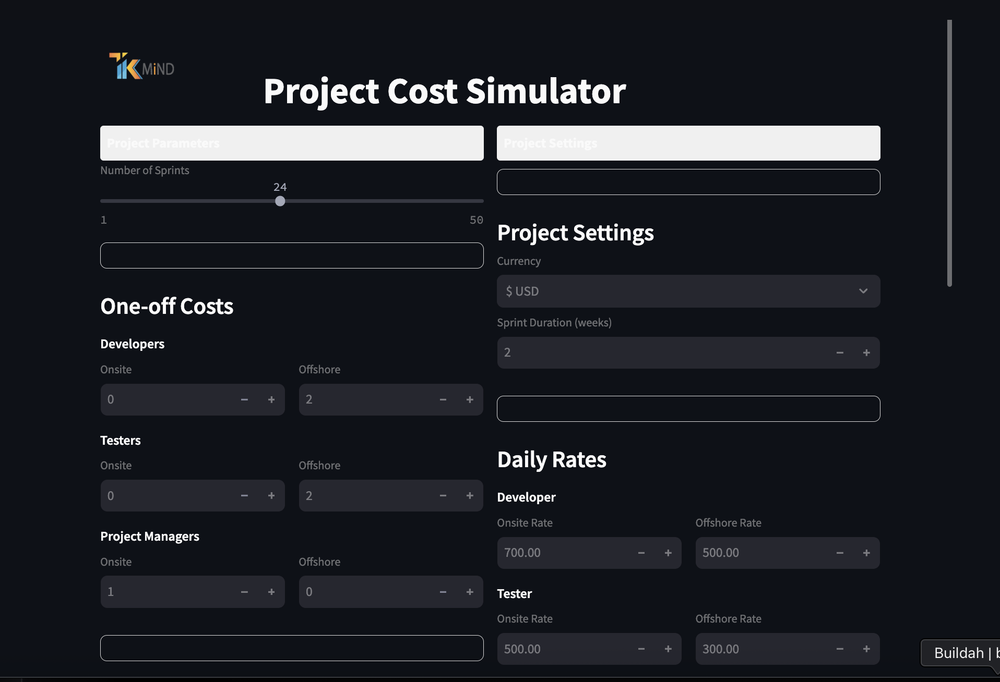

# Project Cost Simulator

A Streamlit-based web application for simulating software project costs with comprehensive features for cost estimation, currency conversion, and commitment-based discounts.

## Overview

The Project Cost Simulator is a web application that helps estimate the total cost of software development projects. It provides a user-friendly interface to calculate costs based on various parameters including team composition, sprint duration, licensing, and managed services.

## Features

- **Project Parameters**: Configure the number of sprints and team composition (developers, testers, project managers) with onsite/offshore roles
- **Currency Support**: Multi-currency support with automatic conversion (USD, EUR, AED, SAR, EGP, GBP)
- **Cost Calculation**: Comprehensive cost calculation including one-off costs, licensing, and managed services
- **Commitment Discounts**: Apply discounts based on contract commitment periods (1, 2, 3, or 5 years)
- **Adjustable Rates**: Configure daily rates for different roles and locations
- **Real-time Updates**: Instant recalculation of totals when any parameter changes
- **Cost Breakdown**: Detailed breakdown of all cost components

## Installation

1. Clone the repository:
```bash
git clone https://github.com/yourusername/cost-simulator.git
cd cost-simulator
```

2. Install the required dependencies:
```bash
pip install -r requirements.txt
```

## Usage

1. Run the Streamlit application:
```bash
streamlit run cost-simulator.py
```

2. The application will open in your default web browser at http://localhost:8501

3. Use the interface to:
   - Set project parameters in the left column
   - Configure rates and settings in the right column
   - View the grand total and cost breakdown
   - Adjust commitment periods and discounts

## Configuration

The application supports the following configuration options:

- **Currency**: Select from multiple currencies with automatic symbol display
- **Team Composition**: Adjust the number of onsite and offshore team members
- **Daily Rates**: Set rates for different roles and locations
- **Running Costs**: Configure licensing and managed service costs
- **Commitment Periods**: Choose from 1, 2, 3, or 5 year commitments with corresponding discounts
- **Markup and Discounts**: Apply additional markup percentages and discounts

## Requirements

- Python 3.7+
- Streamlit
- Pandas (for data manipulation)

All dependencies are listed in the requirements.txt file.

## License

This project is licensed under the MIT License - see the LICENSE file for details.

## Screenshot



## Contributing

Contributions are welcome! Please feel free to submit a Pull Request.

1. Fork the repository
2. Create your feature branch (`git checkout -b feature/AmazingFeature`)
3. Commit your changes (`git commit -m 'Add some AmazingFeature'`)
4. Push to the branch (`git push origin feature/AmazingFeature`)
5. Open a Pull Request

## Acknowledgments

- Streamlit for the web application framework
- The open-source community for inspiration and support
